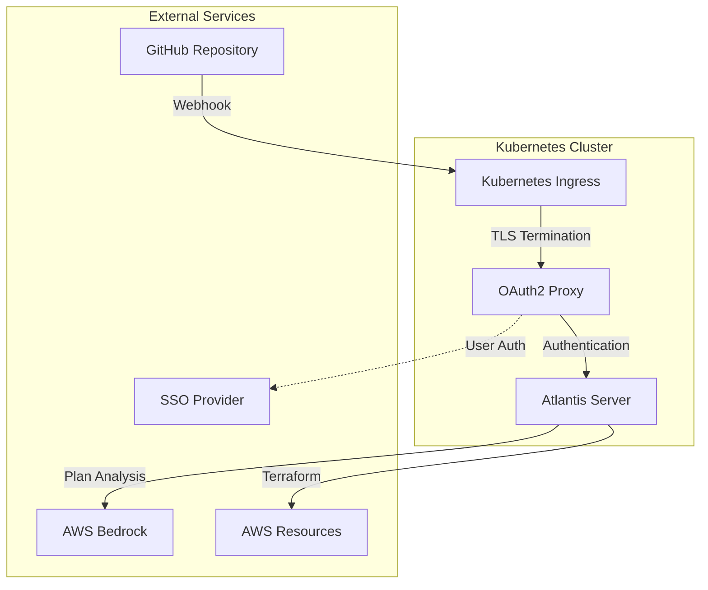

# Atlantis with AI-Powered Terraform Analysis

🤖 **AI-Enhanced Infrastructure Reviews** | 🌐 **Web UI Access** | 🔒 **Enterprise SSO Integration**

This project extends [Runatlantis.io](https://www.runatlantis.io/) with three powerful capabilities:

1. **🤖 AI-Powered Plan Analysis** - AWS Bedrock Claude integration for intelligent Terraform plan review
2. **🌐 Direct Web Access** - Kubernetes ingress setup eliminating the need for `kubectl port-forward`  
3. **🔒 SSO Protection** - OAuth2 proxy integration supporting multiple identity providers

## ✨ Key Features

### 🤖 AI-Powered Analysis
- **Risk Assessment**: Automated blast radius analysis and criticality scoring
- **Impact Evaluation**: Infrastructure change impact with downtime estimates  
- **Security Review**: IAM, networking, and encryption implications analysis
- **Deployment Guidance**: Pre-deployment checks and rollback strategies

### 🌐 Web UI Access
- **Direct HTTPS Access**: No port forwarding required
- **Custom Domain**: Professional atlantis.your-domain.com setup
- **TLS Termination**: Automated certificate management
- **Load Balancing**: Production-ready ingress configuration

### 🔒 Enterprise SSO
- **Multiple Providers**: Azure AD, Google, Okta, and generic OIDC
- **Domain Restrictions**: Email domain-based access control
- **Secure Sessions**: Encrypted cookie management
- **API Bypass**: Webhook endpoints bypass authentication

## 🚀 Quick Start

### Prerequisites
- Kubernetes cluster with ingress controller
- AWS account with Bedrock access
- GitHub App for repository integration
- Domain with DNS management

### 1. Clone and Configure
```bash
git clone https://github.com/your-username/atlantis-ai
cd atlantis-ai

# Update configuration
cp helm/values.yaml helm/values-prod.yaml
# Edit helm/values-prod.yaml with your settings
```

### 2. Create Required Secrets
```bash
# GitHub App credentials
kubectl create secret generic atlantis-github \
  --from-literal=app-id="your-app-id" \
  --from-literal=webhook-secret="your-webhook-secret" \
  --from-file=private-key=github-app-private-key.pem \
  -n atlantis

# OAuth2 SSO credentials  
kubectl create secret generic atlantis-oauth2 \
  --from-literal=client-id="your-sso-client-id" \
  --from-literal=client-secret="your-sso-client-secret" \
  --from-literal=cookie-secret="$(openssl rand -base64 32)" \
  -n atlantis

# AWS credentials for Bedrock (or use IAM roles)
kubectl create secret generic atlantis-aws \
  --from-literal=aws-access-key-id="your-access-key" \
  --from-literal=aws-secret-access-key="your-secret-key" \
  -n atlantis
```

### 3. Build and Push Docker Image
```bash
# Build custom Atlantis image with AI capabilities
cd docker
docker build -t your-account.dkr.ecr.region.amazonaws.com/atlantis-ai:latest .
docker push your-account.dkr.ecr.region.amazonaws.com/atlantis-ai:latest
```

### 4. Install Atlantis
```bash
cd helm
chmod +x install.sh
./install.sh
```

### 5. Configure Repository
```bash
# Copy atlantis.yaml to your Terraform repository root
cp atlantis.yaml /path/to/your/terraform/repo/
# Commit and push to enable Atlantis
```

## 📁 Project Structure

```
atlantis-ai/
├── README.md                    # This file
├── atlantis.yaml               # Atlantis workflow configuration
├── docker/
│   ├── Dockerfile              # Custom Atlantis image with AI
│   └── ai_analyzer.py          # AWS Bedrock analysis script
├── helm/
│   ├── values.yaml             # Helm configuration
│   └── install.sh              # Installation script
├── examples/
│   ├── azure-sso/              # Azure AD SSO setup
│   ├── google-sso/             # Google SSO setup
│   └── aws-bedrock/            # AWS Bedrock configuration
└── docs/
    ├── AI_ANALYSIS.md          # AI analysis deep dive
    ├── SSO_SETUP.md            # SSO configuration guide
    └── SECURITY.md             # Security best practices
```

## 🤖 AI Analysis in Action

When you run `atlantis plan`, the AI analyzer provides:

```
🚨 **RISK: HIGH** | 🎯 **SERVICES: EKS, IAM** | ⏱️ **DOWNTIME: 2-10 minutes**

=== 🎯 BLAST RADIUS & IMPACT ASSESSMENT ===
📊 This change affects 3 critical EKS resources with potential service disruption
🔄 EKS node group replacement will cause rolling restart of all pods
⚠️ IAM role modification may temporarily break pod authentication
🔗 Dependencies: All services using this EKS cluster will be impacted

=== 🔧 TECHNICAL ANALYSIS ===  
🛡️ Security: New IAM permissions reduce over-privileged access (✅)
📊 Performance: Node group resize increases capacity by 50%
🔄 Deployment: Rolling update will take 8-12 minutes
⚠️ Risk: Brief interruption during node replacement

=== 📋 RECOMMENDATIONS & NEXT STEPS ===
📋 **Executive Summary**: EKS node upgrade with security improvements, 10min deployment
🎯 **Pre-deployment**: Verify no critical deployments in progress
🔍 **Monitoring**: Watch pod rescheduling and node readiness
🚨 **Rollback Strategy**: Keep old launch template for 24h emergency rollback
```

## 🔧 Configuration

### Atlantis Workflow (`atlantis.yaml`)
```yaml
version: 3
projects:
  - name: example-infrastructure
    dir: ./terraform/environments/dev
    workspace: dev
    workflow: ai-analysis-workflow

workflows:
  ai-analysis-workflow:
    plan:
      steps:
        - init
        - plan
        - run: |
            PLAN_FILE=$(find . -name "*.tfplan" -type f | head -1)
            if [ -n "$PLAN_FILE" ]; then
              python3 /scripts/ai_analyzer.py "$PLAN_FILE"
            fi
```

### Environment Variables
| Variable | Description | Required |
|----------|-------------|----------|
| `AWS_REGION` | AWS region for Bedrock | Yes |
| `BEDROCK_MODEL_ID` | Claude model ID | Yes |
| `BASE_REPO_OWNER` | GitHub organization | Yes |
| `BASE_REPO_NAME` | Repository name | Yes |
| `BEDROCK_INFERENCE_PROFILE_ARN` | Cost optimization | No |

## 🔒 Security Best Practices

### Secret Management
- **Never commit secrets** to version control
- **Use Kubernetes secrets** for sensitive configuration
- **Rotate credentials** regularly
- **Limit IAM permissions** to minimum required

### Network Security  
- **Private ingress** for internal-only access
- **TLS termination** at ingress level
- **Network policies** to restrict pod communication
- **VPC endpoints** for AWS service access

### Access Control
- **SSO integration** for all human access
- **Service accounts** for automated access  
- **Webhook authentication** bypass only for GitHub
- **Session timeout** configuration

## 🏗️ Architecture



## 📚 Documentation

- **[AI Analysis Guide](docs/AI_ANALYSIS.md)** - Deep dive into AI analysis capabilities
- **[SSO Configuration](docs/SSO_SETUP.md)** - Setting up different SSO providers  
- **[Security Guide](docs/SECURITY.md)** - Security best practices and hardening
- **[Troubleshooting](docs/TROUBLESHOOTING.md)** - Common issues and solutions

## 🤝 Contributing

1. Fork the repository
2. Create a feature branch (`git checkout -b feature/amazing-feature`)
3. Commit your changes (`git commit -m 'Add some AmazingFeature'`)
4. Push to the branch (`git push origin feature/amazing-feature`)
5. Open a Pull Request

## 📄 License

This project is licensed under the MIT License - see the [LICENSE](LICENSE) file for details.

## 🙏 Acknowledgments

- **[Runatlantis.io](https://www.runatlantis.io/)** - The amazing Terraform automation platform this builds upon
- **[AWS Bedrock](https://aws.amazon.com/bedrock/)** - AI/ML platform powering the analysis
- **[OAuth2 Proxy](https://oauth2-proxy.github.io/oauth2-proxy/)** - Authentication proxy for SSO integration

---

**Built with ❤️ for the DevOps community**

*Transform your Terraform workflow with AI-powered insights, seamless web access, and enterprise-grade security.*